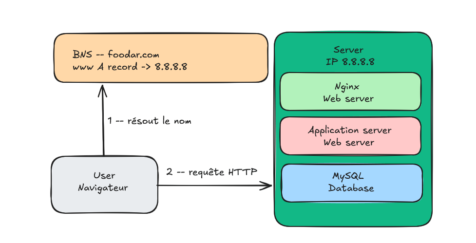

# 0. Simple web stack

A user visits **www.foobar.com**. The domain name resolves to the IP address
`8.8.8.8`, which points to a **single server** that hosts everything: the web
server (Nginx), the application server, the application files (code base) and
the database (MySQL).

## What is a server?

A server is a physical or virtual machine that runs software to provide
services or resources to other computers (the *clients*) over a network. In a
web context, it receives requests and returns responses (web pages, data,
files).

## The role of the domain name

A domain name (`foobar.com`) is a human-readable label that maps to a numeric
IP address. Instead of asking users to remember `8.8.8.8`, they type
`foobar.com`, and the DNS (Domain Name System) translates it into the server's
IP address so the request can be routed to the right machine.

## What type of DNS record is `www` in www.foobar.com?

`www` is an **A record** (Address record). It is a subdomain of `foobar.com`
whose A record points directly to the IPv4 address `8.8.8.8`.

## The role of the web server (Nginx)

The web server handles incoming **HTTP/HTTPS requests**. It serves static
content (HTML, CSS, JavaScript, images) directly and forwards dynamic requests
to the application server. It acts as the entry point for all web traffic.

## The role of the application server

The application server runs the **business logic** of the website. It executes
the application code, processes dynamic requests passed on by the web server,
talks to the database when needed, and generates the dynamic responses that are
sent back to the user.

## The role of the database (MySQL)

The database stores and manages all the persistent data of the application
(users, content, sessions, etc.). The application server queries MySQL to read
and write this data.

## What does the server use to communicate with the user's computer?

The server communicates with the user's computer using the **HTTP protocol
over TCP/IP**. TCP/IP establishes the reliable network connection, and HTTP
defines the format of the requests and responses exchanged on top of it.

## Issues with this infrastructure

- **SPOF (Single Point Of Failure):** there is only one server. If it goes
  down, the entire website becomes unreachable.
- **Downtime during maintenance:** deploying new code often requires
  restarting the web server, making the site unavailable during that time.
- **Cannot scale:** a single server cannot handle a large amount of incoming
  traffic. When the load is too high, it slows down or crashes.
